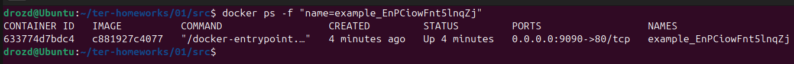

### Домашнее задание по лекции "Введение в Terraform" - Гривняшкин Роман Владимирович.

___

1.2 Допустимо хранить сееркты:
 - в файлах директории `.terraform/`;
 - в файлах, начинающихся с `.terraform` (напрмеир `.terraform.lock.hcl`), но не `.terraformrc`;
 - в файлах состояния `tfstate`;
 - `personal.auto.tfvars`;
 
1.3 `"result": "3qlynHSubmlnbEmX"`

1.4 Ошибки в *main.tf*:
 - упущен второй label для ресурса `docker-image`;
 - ошибка в названии 2 label для ресурса `docker-container`;
 - ошибка в обращении к ресурсу (корректно `random_password.random_string.result`);
 
1.5 *main.tf*
```
resource "docker_image" "nginx"{
  name         = "nginx:latest"
  keep_locally = true
}

resource "docker_container" "nginx" {
  image = docker_image.nginx.image_id
  name  = "example_${random_password.random_string.result}"

  ports {
    internal = 80
    external = 9090
  }
}
```



1.6 Опасность ключа `auto-approve` кроется в том, что послее его применения останется только с грустными глазами наблюдать в неизбежном, с привкусом фатума, выводе `terraform plan` всю тяжесть своей ошибки: трагедию ресурсов, которые уже не спасти.
Однако при автоматизированном развертывании как без него обойтись?

1.7 *terraform.tfstate:*

```
{
  "version": 4,
  "terraform_version": "1.13.5",
  "serial": 14,
  "lineage": "c8303e9a-8657-5780-3211-2ca4c19a0309",
  "outputs": {},
  "resources": [],
  "check_results": null
}
```

1.8 Образ остался благодаря аргументу `keep_locally = true`. Без него образ удалится.
Ибо сказано:
```
force_remove (Логическое значение) Если значение равно true, то образ удаляется принудительно при уничтожении ресурса.
keep_locally (Логическое значение) Если значение равно true, образ Docker не будет удален при операции уничтожения. Если значение равно false, образ будет удален из локального хранилища Docker при операции уничтожения.
```
При одновременном указании аргументов `force_remove` и `keep_locally` победит `force_remove`.

___

2. Создание ВМ в Yandex Cloud и контейнера Mysql посредством docker context.

Выполнение происходит запуском скрипта `./deploy.sh`

Скрипт разворачивает машину с контейнером в 3 этапа:
- создание ВМ в Yandex Cloud с помощью terraform из директории `./terraform_yc/`
- установка docker, создание контекста.
- создание контейнера на удаленной ВМ с помощью terrafom из директории `./terraform_docker`.

Удаление осуществляется запуском скрипта с ключом `-d`.

Я оставил закомментированный блок в `./terraform_docker/docker.tf`, позволяющий развернуть контейнер на удаленной ВМ без docker context.

---

